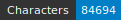

HTRomance: Corpus Medieval Italian
=====================
   

<!-- Custom Zone -->

## Introduction

## Credits

<!-- Rien ne doit être modifié manuellement après la balise Start Auto -->

<!-- Start Auto -->

## Transcription guidelines

The transcription guidelines are described in a paper available on [HAL](https://hal-enc.archives-ouvertes.fr/hal-03828353) and published at the Journal for Open Humanities Data. It provides specific details about the selection process, the transcription methods and choices, as well as details about output (mainly the [Generic CREMMA Model for Medieval Manuscripts (Latin and Old French)](https://zenodo.org/record/7234166#.Y7f69afMJhE) for [Kraken](https://kraken.re))

## Data

ALTO and images can be found in the directory data. Each subfolder of data corresponds to a 
single manuscript, identified by its bookshelf.

<!-- BeginTable -->

| Shelfmark                                                        | Folder                                   | Biblissima   | Range   | Type   |   Century | Color   |   Main Zones |   Lines |   Characters | Genre   | Content                          |
|------------------------------------------------------------------|------------------------------------------|--------------|---------|--------|-----------|---------|--------------|---------|--------------|---------|----------------------------------|
| [BnF Ita 919](https://gallica.bnf.fr/ark:/12148/btv1b52501692k)  | [🔗](medieval-italian/data/bnf-ita-919)  |              | 2r-6v   | prose  |        14 | ✓       |           10 |     185 |         1613 | prose   | Cataloghi di prezzi delle merci  |
| [BnF Ita 434](https://gallica.bnf.fr/ark:/12148/btv1b84363869)   | [🔗](medieval-italian/data/bnf-ita-434)  |              | 1v-3v   | prose  |        14 | ✓       |            5 |     186 |         8570 | prose   | Marco Polo, Il Milione           |
| [BnF Ita 70](https://gallica.bnf.fr/ark:/12148/btv1b8426803g)    | [🔗](medieval-italian/data/bnf-ita-70)   |              | 81r-85v | vers   |        15 | ✓       |            7 |     564 |         7375 | poésie  | Dante, La divina commedia        |
| [BnF Ita 594](https://gallica.bnf.fr/ark:/12148/btv1b8433322f)   | [🔗](medieval-italian/data/bnf-ita-594)  |              | 25r-29v | vers   |        15 | ✓       |           11 |     472 |         9831 | poésie  | El Sinibaldo                     |
| [BnF Ita 820](https://gallica.bnf.fr/ark:/12148/btv1b52500670h)  | [🔗](medieval-italian/data/bnf-ita-820)  |              | 2r-6v   | prose  |        16 | ✓       |           10 |     239 |         4680 | prose   | Vita di Cola di Rienzo (et alia) |
| [BnF Ita 1534](https://gallica.bnf.fr/ark:/12148/btv1b52504356m) | [🔗](medieval-italian/data/bnf-ita-1534) |              | 91-100  | vers   |        16 | ✓       |           10 |     181 |         4100 | poésie  | G.B. Strozzi, Rime               |

<!-- EndTable -->

## Metrics

<!-- StartMetric -->

### Regions

- MainZone (53)
- NumberingZone (31)
- Not specified (34)
- DropCapitalZone (218)
- DamageZone (1)
- MarginTextZone (10)
- text (16)
- DecorationZone (1)
- QuireMarksZone (1)

### Lines

- DefaultLine (1313)
- Numbering (30)
- Not specified (17)
- DropCapitalLine (239)
- default (227)
- Signature (1)

<!-- EndMetric -->

## Funding

This project was funded by the Bibliothèque nationale de France through the 2022 project calls from
[Datalab](https://www.bnf.fr/fr/bnf-datalab).

## Citer le projet

ToDo.

## Infrastructure

This project was produced through the [CREMMA infrastructure](https://www.dim-map.fr/projets-soutenus/cremma/).

