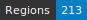
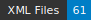

HTRomance, Medieval Italian corpus of ground-truth for Handwritten Text Recognition and Layout Segmentation
=====================
    [](https://github.com/HTRomance-Project/medieval-italian/actions/workflows/htr-united-workflows.yml)

[](https://doi.org/10.5281/zenodo.8256728)

<!-- Custom Zone -->

## Introduction

This ground-truth dataset has been carefully built around the idea of having generic data for building a strong and reliable model for HTR of Italian manuscripts. Each manuscript should have around 10 columns (5 bi-columns pages or 10 pages of single column).

Data follow the Segmonto guidelines.

> [!NOTE]
> The repository contains two XML files per image. The ones suffixed with `.chocomufin.xml` are normalized in order to be compliant with other datasets following the same guidelines. The others are more specific to this repository. We recommend using the normalized documents.

## Credits

- Transcriptions: Rachele Alba, Giorgia Rubin.
- Supervision and manuscript selection: Federic Boschetti, Franz Fischer.
- Project management: Thibault Clérice, Alix Chagué.

<!-- Rien ne doit être modifié manuellement après la balise Start Auto -->

<!-- Start Auto -->

## Transcription guidelines

The transcription guidelines are described in a paper available on [HAL](https://hal-enc.archives-ouvertes.fr/hal-03828353) and published in the Journal for Open Humanities Data. The paper provides specific details about the selection process, the transcription methods and choices, as well as details about the output (mainly the [Generic CREMMA Model for Medieval Manuscripts (Latin and Old French)](https://zenodo.org/record/7234166#.Y7f69afMJhE) for [Kraken](https://kraken.re))

## Data

ALTO and images can be found in the directory called `data/`. Each subfolder of `data/` corresponds to a 
single manuscript, identified by its shelfmark.

<!-- BeginTable -->

| Shelfmark                                                         | Links                  | Range   | Type   |   Century | Color   |   Pages |   Main Zones |   Lines |   Characters | Genre   | Content                            |
|-------------------------------------------------------------------|------------------------|---------|--------|-----------|---------|---------|--------------|---------|--------------|---------|------------------------------------|
| [BnF, it. 481](https://gallica.bnf.fr/ark:/12148/btv1b84268148)   | [📁](data/bnf-it-481)  | 41r-43r | prose  |        14 | ✓       |       5 |           10 |     512 |        15667 |         | Boccaccio, Filocolo                |
| [BnF, it. 79](https://gallica.bnf.fr/ark:/12148/btv1b52507492w)   | [📁](data/bnf-it-79)   | 54r-56r | vers   |        14 | ✓       |       5 |           11 |     423 |        11773 |         | Dante, La divina commedia          |
| [BnF, it. 590](https://gallica.bnf.fr/ark:/12148/btv1b8433319z)   | [📁](data/bnf-it-590)  | 16r-18r | prose  |        14 | ✓       |       5 |           10 |     454 |         9360 |         | Virgilio, Eneide (volgarizzamento) |
| [BnF, it. 434](https://gallica.bnf.fr/ark:/12148/btv1b84363869)   | [📁](data/bnf-it-434)  | 1v-3v   | prose  |        14 | ✓       |       5 |            5 |     185 |         8576 |         | Marco Polo, Il Milione             |
| [BnF, it. 594](https://gallica.bnf.fr/ark:/12148/btv1b8433322f)   | [📁](data/bnf-it-594)  | 25r-29v | vers   |        15 | ✓       |       5 |            5 |     184 |         5132 |         | El Sinibaldo                       |
| [BnF, it. 70](https://gallica.bnf.fr/ark:/12148/btv1b8426803g)    | [📁](data/bnf-it-70)   | 81r-85v | vers   |        15 | ✓       |       5 |            7 |     257 |         7359 |         | Dante, La divina commedia          |
| [BnF, it. 583](https://gallica.bnf.fr/ark:/12148/btv1b84333085)   | [📁](data/bnf-it-583)  | 41r-43r | vers   |        15 | ✓       |       5 |           10 |     373 |         9909 |         | Boccaccio, Teseida                 |
| [BnF, it. 820](https://gallica.bnf.fr/ark:/12148/btv1b52500670h)  | [📁](data/bnf-it-820)  | 2r-6v   | prose  |        16 | ✓       |       5 |            5 |     125 |         4680 |         | Vita di Cola di Rienzo (et alia)   |
| [BnF, it. 1534](https://gallica.bnf.fr/ark:/12148/btv1b52504356m) | [📁](data/bnf-it-1534) | 91-100  | vers   |        16 | ✓       |      10 |           10 |     182 |         4180 |         | G.B. Strozzi, Rime                 |

<!-- EndTable -->

## Metrics

<!-- StartMetric -->

### Total number of pages

50

### Regions

- MainZone (73)
- MarginTextZone (30)
- NumberingZone (34)
- GraphicZone (1)
- DropCapitalZone (41)
- QuireMarksZone (2)
- RunningTitleZone (5)

### Lines

- DefaultLine (2601)
- DropCapitalLine (64)
- InterlinearLine (3)
- HeadingLine (27)

<!-- EndMetric -->

## Funding

This project was funded by the Bibliothèque nationale de France through the 2022 project calls from
[Datalab](https://www.bnf.fr/fr/bnf-datalab) for 2023.

## Cite the project

> Clérice, T., Chagué, A., Gille-Levenson, M., Brisville-Fertin, O., Pinche, A., Camps, J., Fischer, F., Boschetti, F., Guadagnini, E., Guilhem Couffignal, G., Canteaut, O., Romary, L., Reboul, M., Perreaux, N., Poibeau, T., Smith, M., Norindr, J., Glaise, A., Navas Farré, M., Bordier, J., Leroy, N., Alba, R., & Rubin, G. *HTRomance* [Data set]. https://htromance-project.github.io/
```
@misc{Clerice_HTRomance,
author = {Clérice, Thibault and Chagué, Alix and Gille-Levenson, Matthias and Brisville-Fertin, Olivier and Pinche, Ariane and Camps, Jean-Baptiste and Fischer, Franz and Boschetti, Federico and Guadagnini, Elisa  and Guilhem Couffignal, Gilles and Canteaut, Olivier and Romary, Laurent and Reboul, Marianne and Perreaux, Nicolas and Poibeau, Thierry and Smith, Marc and Norindr, Jade and Glaise, Anthony and Navas Farré, Marina and Bordier, Julie and Leroy, Noé and Alba, Rachele and Rubin, Giorgia},
title = {{HTRomance}},
url = {https://htromance-project.github.io/}
}
```

## Infrastructure

This project relied on the [CREMMA infrastructure](https://www.dim-map.fr/projets-soutenus/cremma/).

